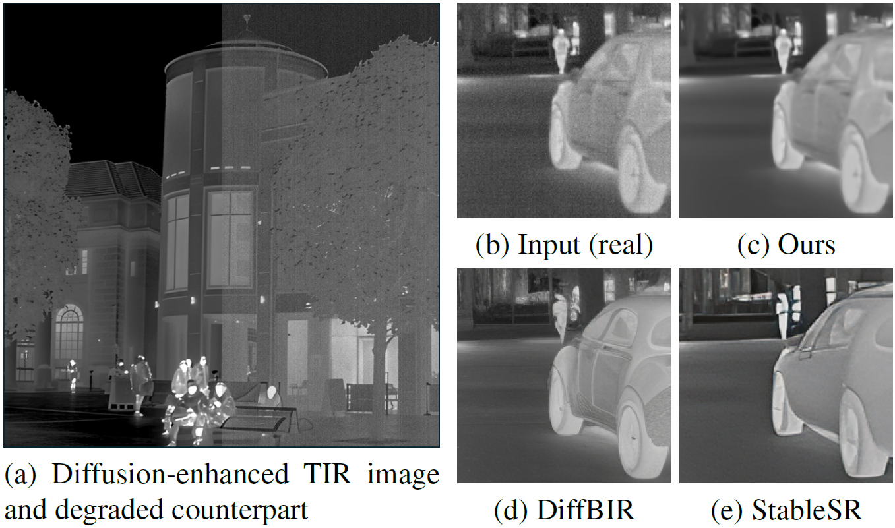

# **Self-supervised Diffusion-guided Hallucination-free Thermal Infrared Image Denoising**
 Félix Hazebrouck<sup>1,2</sup>, Alexander Schock-Schmidtke<sup>1,3</sup>, Norbert Stuhrmann<sup>2</sup>, Johannes Fottner<sup>1</sup>, Michael Teutsch<sup>2</sup>  
<small><sup>1</sup> Technical University of Munich (TUM), Germany
<sup>2</sup> HENSOLDT, Germany, <sup>3</sup> digital workbench, Germany</small>  

 <br/><br/>

**This is the official repository of the paper _Self-supervised Diffusion-guided Hallucination-free Thermal Infrared Image Denoising_, 2026.**  


<div align="center">
<table>
<tr>

<td align="center" height="60">
<a href="https://encrypted-tbn0.gstatic.com/images?q=tbn:ANd9GcTjydBgaiy1TPR3G0LZPDffdruvfqFSfb37lA&s">

</a>
</td>

<td align="center" height="60">
<a href="https://github.com/HensoldtOptronicsCV/Noise2DiffusionEnhanced">

</a>
</td>

<td align="center" height="60">
<a href="https://encrypted-tbn0.gstatic.com/images?q=tbn:ANd9GcTjydBgaiy1TPR3G0LZPDffdruvfqFSfb37lA&s">

</a>
</td>

</tr>
</table>
</div>


*Our approach uses diffusion-based image enhancement and realistic TIR image degradation to generate image pairs for supervised learning (a) and leverages remarkable visual quality of diffusion models (c) without suffering from hallucinations (d-e).*  


<br/><br/>
## Repository Overview

[1. *HDRT-TIR-DE* Dataset](#hdrt_tir_de)  
[2. *Noise2DiffusionEnhanced* Pretrained Denoising Network](#Noise2DiffusionEnhanced)  
[3. TIR Sensor-Noise Generator](#noise_generator)  

<br/><br/>
## 1. *HDRT-TIR-DE* Dataset <a name="hdrt_tir_de"></a> 

The *HDRT-TIR-DE dataset* is a large-scale reference thermal infrared single-image dataset designed to serve as clean reference for self-supervised training schemes.  
 In the name *HDRT-TIR-DE*, *TIR* stands for *Thermal InfraRed* and *DE* for *Diffusion-Enhanced*, while *HDRT* is the name of the dataset the HDRT-TIR-DE build upon.

 The dataset can be downloaded on HuggingFace [here](https://encrypted-tbn0.gstatic.com/images?q=tbn:ANd9GcTjydBgaiy1TPR3G0LZPDffdruvfqFSfb37lA&s), along with the train, validation and test splits, and the fixed noisy images from the validation and test set.  
 The files and content of the dataset are further described there, as well as in the [supplementary material](todo) of our work.

As described in our [paper](todo), the dataset builds upon the thermal part of the [HDRT dataset](https://huggingface.co/datasets/jingchao-peng/HDRTDataset), introduced in [[1]](#1), which was enhanced with an image-restoration diffusion model ([StableSR](https://link.springer.com/article/10.1007/s11263-024-02168-7)) to achieve better perceptual quality than any existing real TIR dataset. Combined with the diverse scenes and high image resolution inherited from the original HDRT-TIR dataset, the HDRT-TIR-DE dataset is particularly well suited for self-supervised training of image restoration networks. The specific restoration task can be determined by the degradation model used for generating the LQ counterparts from the clean images. In our work, we placed focus on TIR sensor-noise removal.

This dataset should contribute to filling the current lack of clean TIR reference images, due to imperfections in real TIR imagers that inevitably introduce noise in every captured real TIR image.  

<br/><br/>
## 2. *Noise2DiffusionEnhanced* Pretrained Denoising Network <a name="Noise2DiffusionEnhanced"></a> 

The *Noise2DiffusionEnhanced* network is a pretrained TIR sensor-noise denoising network with [Uformer architecture](https://openaccess.thecvf.com/content/CVPR2022/html/Wang_Uformer_A_General_U-Shaped_Transformer_for_Image_Restoration_CVPR_2022_paper.html). It was trained on the [HDRT-TIR-diffusion-enhanced](https://huggingface.co/datasets/Aldunitro/HDRT-TIR-diffusion-enhanced) dataset and represents an out-of-the-box working denoising network.  
This pretrained model should contribute to filling the current lack of reference denoising models for TIR single-image denoising, for direct use as well as for related research.  

This section provides a step-by-step installation guide for running inference and/or fine-tuning this denoising method.  
&nbsp;

### 2.1) environment Setup
For this setup, you will need to have anaconda installed on your machine and accessible through the ```conda``` command in your terminal. 

1 - Check if you have a GPU that is recognized:  
```bash
nvidia-smi
```
If you see something like
```bash
Driver Version: 535.xx
CUDA Version: 12.x
```
everything is fine.   
If this line fails, please debug the driver or add a GPU to your machine.  

2 - Clone the repository on your machine:
```bash
cd path/to/future/location/local/copy
git clone https://github.com/HensoldtOptronicsCV/Noise2DiffusionEnhanced.git
```
and go to the ```Uformer_modified``` folder inside the main folder of the local copy:
```bash
cd ./Noise2DiffusionEnhanced/Uformer_modified
```  

3 - Install the environment from the ```uformer_env_no-builds.yml``` file:
```bash
conda env create -f uformer_env_no-builds.yml
```
Possible improvement if dependency solving is slow:
```bash
mamba env create -f uformer_env_no-builds.yml
```
> If this step fails, you can also try installing the environment following the installation guide from the original [Uformer repo](https://github.com/ZhendongWang6/Uformer): the ```requirements.txt``` file is still included in this modified version of the Uformer repository, but we had to comment out the first two lines and install torch and torchvision manually to the latest version to avoid package conflicts. The versions we ended up with are specified in the ```uformer_env_no-builds.yml``` file.  
&nbsp;

### 2.2) Download Pretrained Weights

Download the pretrained weights from the [Huggingface page](todo) in form of the ```model_best.pth``` file, and move it to ```./Uformer_modified/log/Uformer_B/models/model_best.pth``` (```./``` is the main folder of the repository).  
You can move the file to another location, the path to the weights can be set in the ```options.py``` file, the default is the path above.   

### 2.3) Run Inference or Fine-Tune the Model

Set the default variables in ```options.py``` (in ```./Uformer_modified/```) and look at the options that can be modified.

**For inference**, run :  
```bash
python test/inference_custom.py \
--input_dir path/to/noisy/images \
--result_dir path/to/result/directory \
--weights ./Uformer_modified/log/Uformer_B/models/model_best.pth \
--grayscale_output
```

**For fine-tuning the weights**, run :
```bash
python3 ./train/train_denoise.py --arch Uformer_B --dataset sidd --warmup \
--env _train01_fine-tuning \
--train_dir_HQ "path/to/folder/target/images/train" \
--val_dir_HQ "path/to/folder/target/images/val" \
--val_dir_LQ "path/to/folder/noisy/images/val" \
--save_dir ./logs/ \
--batch_size 16 --batch_size 32 --train_ps 128 --gpu '0' \
--resume --pretrain_weights "./Uformer_modified/log/Uformer_B/models/model_best.pth”
```
> ℹ️ NOTES for fine-tuning: 
> - Please do not touch the arguments of the first line (typically the sidd is the option to activate the part of the code I grafted the my noise-generation on, even if there is nothing effective left of the SIDD dataset).
> - The images are paired by name across the HQ- and LQ directory.
> - There is no LQ image folder, as the sensor-noise is sampled annew for each batch and added in a data-augmentation way. If you want to train on fixed noisy images, please use the ```--train_dir_LQ``` argument (also in ```options-py```).
> - You can play with the different options, but we recommend to stay close to the default option-values for reproductibility and because we did not explore the effects of variations in each argument value on training.
> - If you wish to modify the code for more freedom with your data, please notice that the main adaptions with respect to the original Uformer code were achieved in the Dataset class in ```./Uformer_modified/dataset/dataset_denoise.py```. This is probably the best graft-point for your custom data setup.  


<br/><br/>
## 3. TIR Sensor-Noise Generator <a name="noise_generator"></a> 

The single-image TIR sensor-noise generator used in this work is adapted from the video TIR noise generator presented in _Exploring video denoising in thermal infrared imaging: Physics-inspired noise generator, dataset, and model_ by Cai et al. [[2]](#2) an published on [the original repository](https://github.com/cailijing/MDIVDnet). The modifications include adaption of the dimensions and sampling process to single-images, improved efficiency of some parts of the generator and improved readability.  
The original version of this code, and thereby this modified version, is licensed under the MIT license with Copyright (c) 2026 Lijing Cai.

All code related to the TIR sensor-noise generator is grouped in ```./TIR-Noise-Generator/```, with the generator itself in ```./TIR-Noise-Generator/TIR_noise_generator.py```.  
This file (```./TIR-Noise-Generator/TIR_noise_generator.py```) contains all functions needed to generate torch tensors of TIR-specific sensor noise, while handling different channel-numbers by adding the same noise to all channels of an image.  
&nbsp;

### 3.1) Environment Setup (optional, torch and numpy are sufficient)
For running the noise generator, you only need an environment with torch and numpy (see the imports at the beginning of the script). Note that the script is GPU-compatible and that using it (with the ```device``` argument in the ```SampleNoise(...)``` function) speeds up the process. Still, running on CPU was fast enough for our application.   

⚠️ **The following setup guide installs the main environment of our project, which works and fulfills the requirements of the noise generator, but has a lot of overhead with respect to this application alone.**   
We recommend only adding torch and numpy to your working environment, if not already satisfied.  

&nbsp;

For the setup of the main environment, you will need to have anaconda installed on your machine and accessible through the ```conda``` command in your terminal. 

1 - Check if you have a GPU that is recognized (not mandatory, but recommended if generating large amounts of noise-patterns). Type in a bash terminal:  
```bash
nvidia-smi
```
If you see something like
```bash
Driver Version: 535.xx
CUDA Version: 12.x
```
everything is fine.   
If this line fails, you can debug the driver, add a GPU to your machine or just run with argument ```device = 'cpu' ```.  

2 - Clone the repository on your machine (if not done already):
```bash
cd path/to/future/location/local/copy
git clone https://github.com/HensoldtOptronicsCV/Noise2DiffusionEnhanced.git
```
and go to the ```TIR-Noise-Generator``` folder inside the main folder of the local copy:
```bash
cd ./Noise2DiffusionEnhanced/TIR-Noise-Generator
```  

3 - Install the environment from the ```n2de_env_no-builds.yml``` file (:warning bif environment, see bolow):
```bash
conda env create -f n2de_env_no-builds.yml
```
Possible improvement if dependency solving is slow:
```bash
mamba env create -f n2de_env_no-builds.yml
```  
&nbsp;

### 3.2) Generate Noise Patterns

Please read the presentation of the script ```iqam_evaluation.py``` and of the main noise-generator function ```SampleNoise(N:int, C:int, H:int, W:int, noise_params: dict, device, mode="train") -> torch.Tensor```.

**Example of Use**  
The following code snippets can be added in the Dataloader or in the training loop to create the noisy counterparts from the clean targets:

**CASE 1) degrading an image batch:** 
```bash 
    noise_params = GetNoiseSamplingParamsLighterNoise()
    N,C,H,W = hq_image_batch.size()
    noisy_batch = SampleNoise(N, C, H, W, noise_params, device=batch_device, mode="train")
    noisy_batch += hq_image_batch # clean tensor remains unchanged
```

**CASE 2) degrading a single image:**
```bash
    noise_params = GetNoiseSamplingParamsLighterNoise()
    C,H,W = hq_image.size()
    noisy_image = SampleNoise(1, C, H, W, noise_params, device=image_device, mode="train")[0]
    noisy_image += clean_image # clean tensor remains unchanged
```

> ℹ️ NOTES for this examples: 
> - The original values for the standard deviations for the respective noise-compounds from [[2]](#2) were fixed through experiments to match the real noise of a specific TIR imager. This noise was obviously too strong with respect to (real) images from the FLIR dataset [[3]](#3), which is why the sampling parameters for the noise were adjusted in our work to the ones outputted by ```GetNoiseSamplingParamsLighterNoise()```. The latter were qualitatively determined and can not account for all thermal imagers.  
Therefore, **you will probably need to adjust these parameters to match the noise statistics of your imager**.
> - Depending on the given standard deviations for sampling, the noise can be sampled for [0,1]-float-images, as well as for [0,255] or any other value-range.
> - The dictionary outputted by ```GetNoiseSamplingParamsLighterNoise()``` are dimensioned for [0,1] image-representations. The values before division by 255 in the function are with respect to [0, 255] image-encoding. To use your own standard deviations, please mimic the build of the dictionary in the function.


<br/><br/>
## Citation

If you find our work useful, please consider citing it:

    @article{TODO
    }


<br/><br/>
## References
<a id="1">[1]</a> 
Jingchao Peng, Thomas Bashford-Rogers, Francesco Banterle, Haitao Zhao, and Kurt Debattista. _HDRT: A large-scale dataset for infrared-guided HDR imaging_. Elsevier Information Fusion, 120, 2025

<a id="2">[2]</a> 
Lijing Cai, Xiangyu Dong, Kailai Zhou, and Xun Cao. _Exploring video denoising in thermal infrared imaging: Physics-inspired noise generator, dataset, and model_, IEEE 2022

<a id="3">[3]</a> 
Teledyne FLIR. [_FLIR ADAS Thermal Dataset V2.0.0_](https://adas-dataset-v2.flirconservator.com/#downloadguide), 2022